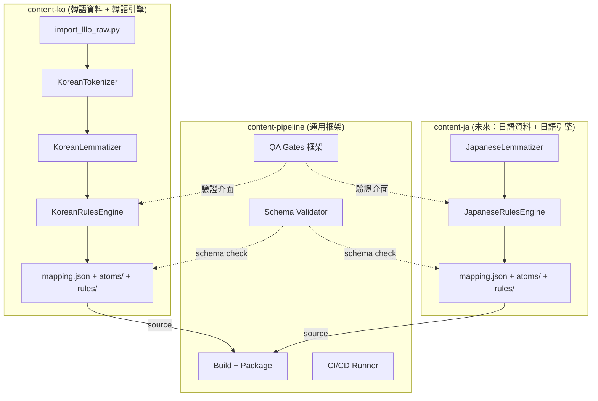
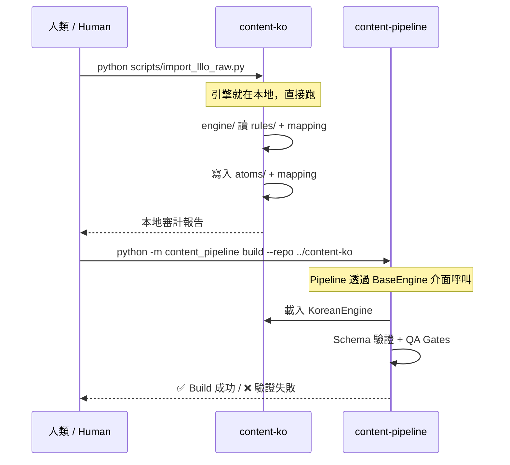
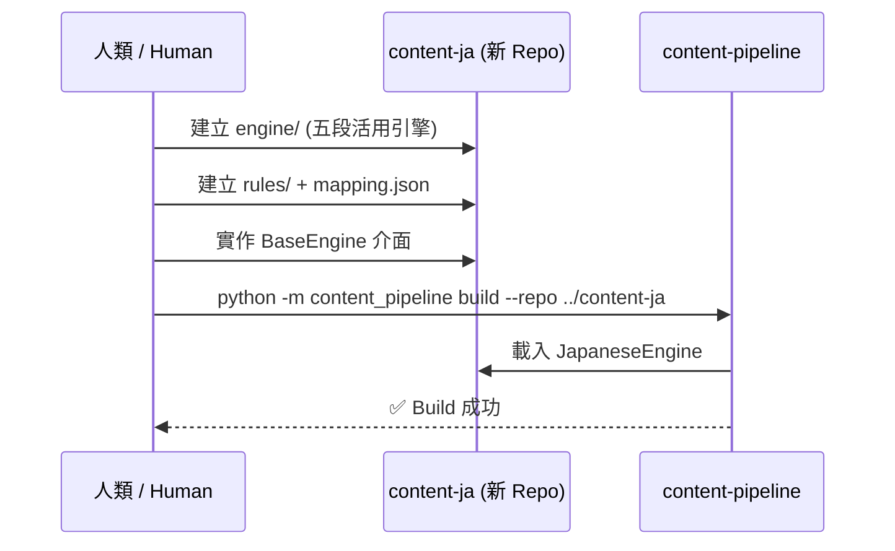

# Content 與 Pipeline 的職責分離策略
# Content vs Pipeline Separation Strategy

> **對象 / Audience**: 專案擁有者，用於決定如何重構 Repo 邊界。
>
> **最後更新 / Last Updated**: 2026-02-15 (v2 — 修正引擎歸屬)

---

## 0. 問題描述 / Problem Statement

> 目前 `content-ko` 同時承擔了「資料倉庫」和「處理引擎」兩個角色，且 `content-pipeline` 幾乎是空的。需要釐清兩者的邊界。
>
> Currently `content-ko` serves as both "data warehouse" and "processing engine", while `content-pipeline` is nearly empty. The boundary needs clarification.

### 現狀盤點 / Current Inventory

**`content-ko/scripts/` — 共 30 個腳本 + `core/` 引擎**

| 類別 / Category | 檔案 / Files | 數量 / Count | 應該在哪 / Should live in |
|---|---|---|---|
| 🏭 **韓語分詞引擎** | `core/rules_engine.py`, `core/lemmatizer.py`, `core/tokenizer.py` | 3 | ✅ **留在 content-ko** |
| 📏 **韓語語法規則** | `core/rules/00_dictionary.json` ~ `70_modifiers_fallback.json` | 8 | ✅ **留在 content-ko** |
| 📥 **韓語攝取腳本** | `import_lllo_raw.py`, `import_lllo.sh`, `import_lllo_ko.py` | 3 | ✅ **留在 content-ko** |
| 🔧 **韓語產生器** | `generate_dictionary_core.py`, `generate_dictionary_i18n.py`, `generate_mapping_patch.py`, `generate_proper_noun_patch.py` | 4 | ✅ **留在 content-ko** |
| 🔍 **審計/驗證** | `audit_content_tokens.py`, `audit_tokens.py`, `validate.sh`, `validate_p1.py`, `benchmark_p1.py`, `verify_lemma.py` | 6 | ⚠️ 語言專用→留 / 通用→pipeline |
| 🏗️ **通用品管** | `core/qa_gates.py`, `core/cache_manager.py` | 2 | ❌ **搬到 content-pipeline** |
| 🛠️ **一次性工具/修補** | `add_final_entries.py`, `add_remaining_entries.py`, `migrate_legacy_atoms.py` 等 | 10 | 🗑️ 歸檔或刪除 |
| 📊 **分析/除錯** | `analyze_unresolved.py`, `debug_lookup.py`, `test_hangul.py` 等 | 6 | 📌 留在 content-ko |

**`content-pipeline/` — 幾乎是空的**

| 檔案 / File | 功能 / Function |
|---|---|
| `pipelines/build_ko_zh_tw.py` | 從 content-ko 讀取 → Schema 驗證 → 輸出可發佈資產 |
| `scripts/build.sh` | 空殼 shell script |

---

## 1. 修正後的分離原則 / Revised Separation Principles

> [!IMPORTANT]
> **核心原則：每個語言的分詞引擎跟著該語言的 Content Repo 走。Pipeline 只放「所有語言都共用」的通用框架。**
>
> **Core Principle: Each language's tokenization engine lives with its content repo. Pipeline only holds language-agnostic, universal framework code.**

### 為什麼引擎要跟著 Content？ / Why does the engine stay with Content?

| 理由 / Rationale | 說明 / Explanation |
|---|---|
| **引擎就是語言的一部分** | `KoreanLemmatizer` 裡面全是韓語的不規則變化表，它跟 `mapping.json` 一樣是「韓語專屬知識」 |
| **引擎和規則是一體的** | `rules_engine.py` 讀取 `rules/*.json`，兩者有緊密耦合，拆開反而增加複雜度 |
| **開發時需要共同修改** | 修一個 Jamo bug 時，你同時需要改 `rules_engine.py` 和 `30_verb_endings.json`，放同一個 Repo 比較方便 |
| **擴展時互不影響** | 未來加日語時，`content-ja` 有自己的 `JapaneseLemmatizer`，跟韓語完全無關 |

### 什麼才放 Pipeline？ / What belongs in Pipeline?

只有**所有語言都一樣**的邏輯才放 `content-pipeline`：

| 放 Pipeline 的東西 | 不放 Pipeline 的東西 |
|---|---|
| Schema 驗證 (validate.py) | 韓語分詞 (rules_engine.py) |
| QA Gate 框架 (qa_gates.py) | 韓語詞幹還原 (lemmatizer.py) |
| Build 通用步驟 (copy, validate, package) | 韓語攝取 (import_lllo_raw.py) |
| 發佈前檢查 (encoding, ID 格式) | 韓語語法規則 (rules/*.json) |
| Windows 路徑修復 | 韓語字典產生器 |
| CI/CD 整合 | 日語五段活用引擎 |



---

## 2. 目標架構 / Target Architecture

### 重構後的目錄結構 / Post-Migration Structure

```
content-ko/                          ← 韓語資料 + 韓語引擎
├── content/
│   └── source/ko/
│       ├── core/
│       │   ├── dictionary/atoms/    ← Atom JSON 檔
│       │   ├── grammar/             ← 文法 JSON 檔
│       │   └── dialogue/            ← 對話 JSON 檔
│       └── i18n/
│           ├── mapping.json         ← 表層→ID 對照表
│           └── zh_tw/               ← 翻譯檔
├── engine/                          ← 韓語專用引擎 (從 scripts/core/ 重整)
│   ├── __init__.py
│   ├── rules_engine.py              ← 韓語規則引擎
│   ├── lemmatizer.py                ← 韓語詞幹還原
│   ├── tokenizer.py                 ← 韓語分詞
│   └── rules/                       ← 韓語語法規則 JSON
│       ├── 00_dictionary.json
│       ├── 10_irregulars.json
│       ├── 30_verb_endings.json
│       └── ...
├── scripts/                         ← 韓語專用工具
│   ├── import_lllo_raw.py           ← 攝取腳本
│   ├── generate_dictionary_core.py  ← 字典產生
│   ├── generate_mapping_patch.py    ← Mapping 補丁
│   └── debug_lookup.py              ← 除錯工具
├── staging/                         ← 手動補丁暫存
│   └── manual_mapping_additions.json
└── docs/                            ← 技術文件
```

```
content-ja/ (未來)                    ← 日語資料 + 日語引擎
├── content/source/ja/               ← 日語資料
├── engine/                          ← 日語專用引擎
│   ├── rules_engine.py              ← 五段活用引擎
│   ├── lemmatizer.py                ← 日語詞幹還原
│   └── rules/                       ← 日語語法規則 JSON
│       ├── godan_matrix.json        ← 五段動詞矩陣
│       ├── ichidan.json             ← 一段動詞
│       └── onbin.json               ← 音便規則
└── scripts/
```

```
content-pipeline/                    ← 通用框架 (與語言無關)
├── framework/                       ← [NEW] 通用工具庫
│   ├── __init__.py
│   ├── qa_gates.py                  ← 品管框架 (從 content-ko 搬來)
│   ├── cache_manager.py             ← 快取管理 (從 content-ko 搬來)
│   ├── encoding.py                  ← [NEW] 通用編碼標準化 (NFC/NFD)
│   └── path_safety.py               ← [NEW] Windows 路徑處理 (從 fix_windows_paths 抽取)
├── pipelines/                       ← 建置流程
│   ├── build.py                     ← [NEW] 通用 build 入口
│   ├── build_ko_zh_tw.py            ← 已存在
│   └── validate.py                  ← [NEW] 通用 schema 驗證
├── contracts/                       ← [NEW] 引擎介面定義
│   └── engine_interface.py          ← 抽象基底類別 (BaseEngine)
└── tests/                           ← 框架測試
    └── test_qa_gates.py
```

---

## 3. 引擎介面契約 / Engine Interface Contract

為了讓 Pipeline 能以統一方式呼叫各語言的引擎，定義一個抽象介面：

To allow the Pipeline to call each language's engine uniformly, we define an abstract interface:

```python
# content-pipeline/contracts/engine_interface.py

from abc import ABC, abstractmethod
from typing import List, Dict, Any

class BaseEngine(ABC):
    """所有語言引擎必須實作此介面 / All language engines must implement this."""

    @abstractmethod
    def tokenize(self, text: str) -> List[Dict[str, Any]]:
        """將文本分詞为原子序列 / Tokenize text into atom sequence."""
        ...

    @abstractmethod
    def resolve_lemma(self, token: str) -> str:
        """將表層形還原為辭典形 / Resolve surface form to dictionary form."""
        ...

    @abstractmethod
    def validate_reconstruction(self, tokens: List[Dict], original: str) -> bool:
        """驗證原子序列能否還原為原始文本 / Verify atoms can reconstruct original text."""
        ...
```

```python
# content-ko/engine/__init__.py — 實作此介面

from content_pipeline.contracts.engine_interface import BaseEngine

class KoreanEngine(BaseEngine):
    def tokenize(self, text):
        return self.tokenizer.tokenize_text(text)

    def resolve_lemma(self, token):
        return self.lemmatizer.resolve(token)

    def validate_reconstruction(self, tokens, original):
        return "".join(t["surface"] for t in tokens) == original
```

Pipeline 透過介面呼叫，不需要知道裡面的韓語邏輯：
Pipeline calls through the interface, without knowing Korean internals:

```python
# content-pipeline/pipelines/build.py

def build(lang: str, content_repo_path: str):
    engine = load_engine(lang, content_repo_path)  # 動態載入
    for sentence in sentences:
        tokens = engine.tokenize(sentence)
        assert engine.validate_reconstruction(tokens, sentence)
```

---

## 4. 遷移計畫 / Migration Plan

### Phase 0：整理 content-ko 內部結構 (不跨 Repo)
- [x] 將 `scripts/core/` 重命名為 `engine/`
- [x] 將 `scripts/core/rules/` 搬到 `engine/rules/`
- [x] 一次性腳本 (`add_final_entries.py` 等) 歸檔到 `scripts/archive/`
- [x] 確認所有 import 路徑仍然正確

### Phase 1：建立 Pipeline 框架
- [x] 在 `content-pipeline` 中建立 `framework/` 和 `contracts/`
- [x] 定義 `BaseEngine` 介面
- [x] 將 `qa_gates.py` 和 `cache_manager.py` 搬到 `framework/`
- [x] 新增 `encoding.py`（通用 NFC/NFD 標準化）
- [x] 新增 `path_safety.py`（通用 Windows 路徑處理）

### Phase 2：content-ko 實作介面
- [x] 讓 `content-ko/engine/` 實作 `BaseEngine`
- [x] Pipeline 的 `build.py` 透過介面呼叫 content-ko 的引擎
- [x] 端到端驗證：`python pipelines/build.py --content-repo ../content-ko --lang ko --output ../release-aggregator/staging/`

### Phase 3：清理與歸檔
- [x] 歸檔一次性腳本
- [x] 更新所有文件的路徑引用 (DONE in SEP-05)

---

## 5. 分離後的工作流 / Post-Separation Workflow

### 日常操作 / Daily Operations



### 新語言 (如日語) 的啟動步驟 / New Language Bootstrap



---

## 6. 時間規劃建議 / Timeline Recommendation

| 階段 / Phase | 預估工時 / Effort | 優先級 / Priority | 前置條件 / Prerequisite |
|---|---|---|---|
| **Phase 0** 整理 content-ko 內部 | 1-2 小時 | 🟢 可以現在做 | 無 |
| **Phase 1** Pipeline 框架 | 3-4 小時 | 🟡 等韓語穩定後 | KO-RES-03B 結束 |
| **Phase 2** 介面實作 | 2-3 小時 | 🟡 與 Phase 1 同時 | Phase 1 |
| **Phase 3** 清理歸檔 | 1 小時 | 🔵 低優先 | Phase 1+2 |

> [!TIP]
> **比之前的規劃更輕量**：因為引擎不用搬了，Phase 1 的風險降低很多。Pipeline 只需要建框架，不需要搬移複雜的語言邏輯。

---

## 7. 常見疑問 / FAQ

### Q: 這樣 content-ko 裡面不是還是有「程式碼」嗎？
**A**: 是的，但這些程式碼**等同於語言學資料的延伸**。`KoreanLemmatizer` 裡的不規則動詞表跟 `mapping.json` 本質相同——都是「韓語知識」，只是格式不同（Python vs JSON）。把它們拆開反而不自然。

### Q: 那 content-pipeline 還有什麼用？
**A**: Pipeline 負責以下**跨語言通用**的事：
1. **Schema 驗證**：確保所有語言的 atoms/mapping 符合 `core-schema`
2. **QA 框架**：提供統一的品管指標（未解析率、信心度分佈）
3. **Build + Package**：將 content 產出的原始碼打包為可發佈資產
4. **CI/CD**：自動化測試與發佈流程

### Q: 如果兩個語言的引擎有共用邏輯怎麼辦？
**A**: 抽取到 `content-pipeline/framework/` 中。例如 `encoding.py`（NFC/NFD 處理）、`path_safety.py`（路徑標準化）是所有語言都會用的，放 pipeline。但 Lemmatizer、RulesEngine 這種語言專屬邏輯，**絕對不放 pipeline**。

### Q: 如果未來要支援 10 個語言，每個都要寫引擎？
**A**: 是的，但它們可以參考模板。`content-ko/engine/` 的結構就是模板——新語言只需要實作 `BaseEngine` 介面，並填入自己的語言規則即可。五段活用比韓語不規則變化規律得多，日語的引擎會比韓語簡單。
