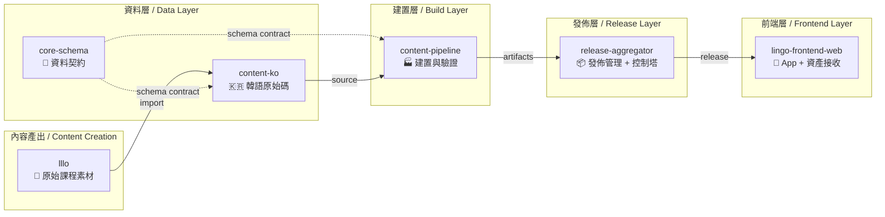
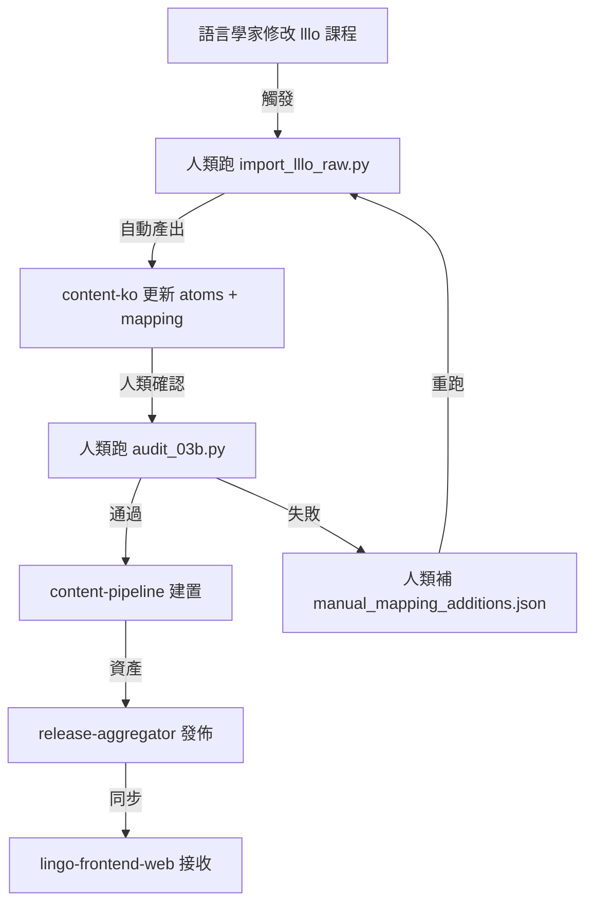
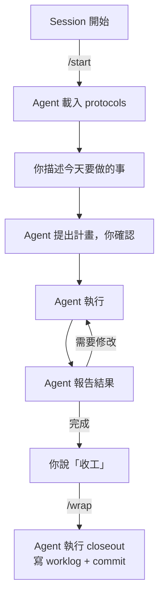

# Lingo 倉庫職責總覽與 Agent 協作指南
# Lingo Repository Responsibilities & Agent Collaboration Guide

> **對象 / Audience**: 專案擁有者（人類），用於瞭解每個 Repo 的職責以及如何與 AI Agent 協作。
>
> **最後更新 / Last Updated**: 2026-04-17

---

## 0. 系統全景 / System Landscape



---

## 1. 各 Repo 詳細職責 / Repository Responsibilities

---

### 📝 `lllo` — 原始課程素材 / Raw Course Material

| 項目 / Item | 說明 / Description |
|---|---|
| **一句話 / TL;DR** | 語言學家撰寫的原始課程，是所有內容的「上游水源」 |
| **包含什麼 / Contains** | Markdown 課程檔、對話腳本、詞彙表 |
| **不包含什麼 / Does NOT contain** | 任何可發佈的 JSON 產物 |
| **關鍵目錄 / Key Dirs** | `data/courses/ko/locales/zh-TW/A1/` — 韓語 A1 課程 |

#### 🧑 人類管理要點 / Human Management

- **這是「唯讀上游」**：`lllo` 的內容只會被 `content-ko` 的 ingestion 腳本讀取，**永遠不會被寫入**。
- **修改 lllo 等於重新觸發 ingestion**：如果語言學家修改了 `lllo` 裡的課程，需要重跑 `import_lllo_raw.py`。
- **不要直接從 lllo 發佈**：它不是 release repo。

#### 🤖 Agent 溝通要點 / Agent Communication

- Agent 可以讀取 `lllo`，但**絕不應該寫入**。
- 如果 Agent 提議修改 `lllo`，它應該改為建議你（人類）通知語言學家。
- 指令範例：「請幫我分析 lllo/data/courses/ko 的 L05 課程，看有什麼新增詞彙」

---

### 🇰🇷 `content-ko` — 韓語內容原始碼 / Korean Content Source

| 項目 / Item | 說明 / Description |
|---|---|
| **一句話 / TL;DR** | 韓語的「真相來源 (Source of Truth)」，包含所有原子化後的內容 |
| **包含什麼 / Contains** | `mapping.json`, `engine/` (Tokenizer, Rules), `content/source/ko/`, ingestion 腳本 |
| **不包含什麼 / Does NOT contain** | 建置邏輯、前端程式碼、發佈腳本 |
| **關鍵目錄 / Key Dirs** | `content/source/ko/` — 正式原始碼<br/>`engine/` — 核心規則引擎與語法規則<br/>`scripts/ops/` — 主要維運腳本 |

#### 🧑 人類管理要點 / Human Management

- **主要操作**：跑 `python scripts/ops/import_lllo_raw.py` 來匯入新內容。
- **手動補丁**：未解析的 Token 需要你手動加到 `content/staging/manual_mapping_additions.json`。
- **品質檢查**：跑 `python scripts/ops/audit_reconstruction.py` 進行 100% 還原度檢查。
- **日常維護的指令**：

```bash
# 匯入新內容 / Import new content
python scripts/ops/import_lllo_raw.py

# 審計還原度 / Audit reconstruction quality
python scripts/ops/audit_reconstruction.py
```

#### 🤖 Agent 溝通要點 / Agent Communication

- ✅ **適合交給 Agent 的事**：
  - 新增規則到 `engine/rules/*.json`
  - 修復 `engine/` 中的還原邏輯問題
  - 分析 `audit_reconstruction.txt` (由 `audit_reconstruction.py` 產出) 並提出修復建議
  - 更新 `mapping.json` 中的缺漏詞
- ⚠️ **需要人類確認的事**：
  - 刪除任何 `atoms/*.json`（可能影響前端）
  - 修改 `mapping.json` 的 ID 格式（跨 repo 契約）

> [!TIP]
> **推薦指令**：
> - 「幫我看 `audit_reconstruction_results.txt`，確認是否真的 100% 通過品質門檻」
> - 「幫我優化 `engine/rules/30_verb_endings.json` 中的規則」
> - 「跑一次 `import_lllo_raw.py`，報告新發現的 Atom 數量」

---

### 📐 `core-schema` — 資料契約 / Data Contracts

| 項目 / Item | 說明 / Description |
|---|---|
| **一句話 / TL;DR** | 定義所有 JSON 檔案的結構規範，是跨 Repo 的「法律條文」 |
| **包含什麼 / Contains** | JSON Schema 定義、範例檔案、版本控制策略 |
| **不包含什麼 / Does NOT contain** | 任何實際內容或建置腳本 |
| **關鍵目錄 / Key Dirs** | `schemas/` — Schema 定義<br/>`examples/` — 範例 JSON<br/>`validators/` — 驗證腳本 |

#### 🧑 人類管理要點 / Human Management

- **修改 Schema = 破壞性變更**：任何 Schema 改動都可能影響所有下游 Repo。
- **版本策略 / Versioning**：參考 `VERSIONING.md`，遵循 SemVer。
- **修改前務必確認**：`content-ko` 和 `content-pipeline` 是否能處理新的 Schema 版本。

#### 🤖 Agent 溝通要點 / Agent Communication

- ✅ **適合交給 Agent 的事**：
  - 檢查某個 JSON 是否符合 Schema
  - 新增欄位到 Schema（需人類確認）
  - 產生 Schema 範例檔案
- 🚫 **不適合交給 Agent 的事**：
  - 刪除 Schema 欄位（需要完整的跨 Repo 影響評估）

> [!IMPORTANT]
> **推薦指令**：
> - 「幫我檢查 `content-ko/content/source/ko/core/dictionary/atoms/V/ko__v__하다.json` 是否符合最新的 atom schema」
> - 「我想在 Atom schema 加一個 `frequency_rank` 欄位，幫我評估影響範圍」

---

### 🏭 `content-pipeline` — 建置與驗證 / Build & Validation

| 項目 / Item | 說明 / Description |
|---|---|
| **一句話 / TL;DR** | 將 `content-ko` 的原始碼建置為可發佈的資產 |
| **包含什麼 / Contains** | 建置腳本、CI/CD 定義、驗證 Gate |
| **不包含什麼 / Does NOT contain** | 原始內容、Schema 定義 |
| **關鍵目錄 / Key Dirs** | `pipelines/` — Pipeline 定義<br/>`scripts/` — 建置腳本 |

#### 🧑 人類管理要點 / Human Management

- **目前狀態 (Current)**：實現了通用 Pipeline 框架與語言引擎 (`content-ko/engine`) 的分離。建置邏輯已遷移至此 Repo。
- **長期目標 (Long-term)**：支援所有 Lingo 語言課程的統一化分詞、驗證與 Release 產物封裝。

#### 🤖 Agent 溝通要點 / Agent Communication

- ✅ 適合讓 Agent 設計 Pipeline 架構或撰寫建置腳本。
- ⚠️ 由於此 Repo 較新，Agent 可能需要較多上下文。建議先指向 `docs/human-handbook/00_START_HERE.md` 與 `docs/human-handbook/01_E2E_STAGES.md`。

---

### 📦 `release-aggregator` — 發佈管理 + 控制塔 / Release Management + Control Tower

| 項目 / Item | 說明 / Description |
|---|---|
| **一句話 / TL;DR** | 整個生態系的「控制塔」，管理發佈流程與所有跨 Repo 文件 |
| **包含什麼 / Contains** | 發佈腳本、跨 Repo 文件 (index.md)、工作日誌 (worklogs)、操作手冊 (runbooks)、使用者指南 (guides) |
| **不包含什麼 / Does NOT contain** | 實際內容、Schema、前端程式碼 |
| **關鍵目錄 / Key Dirs** | `docs/guides/` — 📖 使用者文件（你正在看的）<br/>`docs/runbooks/` — 📋 操作手冊（Agent 用）<br/>`docs/worklogs/` — 📝 每日工作日誌<br/>`docs/ops/` — ⚙️ 操作規範 |

#### 🧑 人類管理要點 / Human Management

- **你的「總覽儀表板」**：需要找任何文件時，從 `docs/index.md` 開始。
- **Worklogs**：每次工作結束後，確認 `docs/worklogs/` 中有當天的日誌。
- **使用者文件**：所有「寫給你看的」文件都放在 `docs/guides/`。

#### 🤖 Agent 溝通要點 / Agent Communication

- ✅ **適合交給 Agent 的事**：
  - 撰寫新的 Guide 文件或 Runbook
  - 更新 Worklog
  - 整理跨 Repo 的文件索引
- ⚠️ **Session 開始/結束**：
  - 開始時: Agent 應執行 `/start` workflow
  - 結束時: Agent 應執行 `/wrap` workflow（自動選擇對應的 closeout protocol）

> [!TIP]
> **推薦指令**：
> - 「幫我寫今天的 worklog」
> - 「幫我把 content-ko 的最新進度更新到 aggregator 的 index」

---

### 📱 `lingo-frontend-web` — App + 資產接收 / Frontend App + Asset Intake

| 項目 / Item | 說明 / Description |
|---|---|
| **一句話 / TL;DR** | Flutter Web 應用程式，負責接收發佈的資產並呈現給使用者 |
| **包含什麼 / Contains** | Flutter 程式碼、已匯入的 production 資產 (`assets/content/production/`)、前端測試 |
| **不包含什麼 / Does NOT contain** | 內容產生邏輯、建置 Pipeline |
| **關鍵目錄 / Key Dirs** | `assets/content/production/packages/` — 各語言的正式資產<br/>`.agent/skills/` — Agent 的 Flutter 開發技能包 |

#### 🧑 人類管理要點 / Human Management

- **資產更新**：當 `release-aggregator` 有新版本時，需要將資產同步到 `assets/content/production/`。
- **Flutter Skills**：前端 Agent 有專用的 Skills 文件（`.agent/skills/flutter-coding-standards/` 等），這些是給 Agent 的「開發規範手冊」。

#### 🤖 Agent 溝通要點 / Agent Communication

- ✅ **適合交給 Agent 的事**：
  - Flutter UI 開發與除錯
  - TTS (語音合成) 相關問題
  - 資產同步與驗證
- ⚠️ **Agent 的技能包**：此 Repo 的 Agent 已配備 Flutter 專用 Skills，它會自動參考 `.agent/skills/` 中的規範進行開發。

> [!TIP]
> **推薦指令**：
> - 「幫我修復 TTS 模組的語音品質問題」
> - 「幫我更新 assets 裡的 ko mapping，用 content-ko 最新版本」

---

## 2. 跨 Repo 工作流 / Cross-Repo Workflow

### 資料流向 / Data Flow



### 跨 Repo 操作原則 / Cross-Repo Rules

| 原則 / Rule | 說明 / Description |
|---|---|
| **單一職責 / Single Responsibility** | 每個 Repo 只做自己的事。如果一個任務需要改兩個 Repo，拆成兩個獨立任務。 |
| **契約優先 / Contract First** | 任何跨 Repo 的資料格式變更，必須先更新 `core-schema`。 |
| **向下相容 / Backward Compatible** | Schema 變更必須向下相容，除非有明確的 Migration Plan。 |
| **審計必過 / Audit Gate** | 在發佈前，`qa_v5_gate.py` (或 `audit_reconstruction.py`) 的結果必須為 SUCCESS。 |

---

## 3. Agent 協作最佳實踐 / Agent Collaboration Best Practices

### 3a. 與 Agent 溝通的心法 / Communication Mindset

| ✅ 有效的做法 / What works | ❌ 避免的做法 / What to avoid |
|---|---|
| 指定具體的檔案或目錄 | 說「幫我改一下那個 mapping」（哪個？） |
| 先告訴 Agent 讀某份文件再操作 | 直接叫 Agent 做一個它沒上下文的事 |
| 要求 Agent 先報告分析再動手修改 | 讓 Agent 一口氣修 10 個檔案 |
| 用中文溝通，Agent 會自動處理技術術語 | 不需要特別切換語言 |

### 3b. 推薦的 Session 流程 / Recommended Session Flow



### 3c. 每個 Repo 的 Agent 指令速查表 / Agent Command Cheat Sheet

| Repo | 常用指令 / Common Commands |
|---|---|
| `content-ko` | 「分析 audit 結果」「修復 XX 的 Jamo 問題」「跑 import」「補 mapping」 |
| `core-schema` | 「檢查 XX.json 是否符合 schema」「新增欄位 XX 到 atom schema」 |
| `content-pipeline` | 「設計新的驗證 gate」「寫建置腳本」 |
| `release-aggregator` | 「寫 worklog」「更新 index」「整理過時文件 (mac)」 |
| `lingo-frontend-web` | 「修 bug」「更新 assets」「修 TTS」 |
| `lllo` | 「分析 L05 課程」「統計新增詞彙」（唯讀） |

### 3d. Agent 的行為邊界 / Agent Boundaries

> [!CAUTION]
> **Agent 絕對不應該在沒有你確認之前做的事：**
> 1. 刪除任何 `atoms/*.json` 或 `mapping.json` 中的條目
> 2. 修改 `core-schema` 的 Schema 定義
> 3. 直接改動 `lllo` 的原始課程檔
> 4. 修改跨 Repo 的 ID 命名格式
>
> 如果 Agent 提議這類操作，它應該先給你看影響範圍，等你同意後再執行。

---

## 4. 目錄導航 / Directory Navigation

| 你想要… / You want to… | 去哪裡 / Go to… |
|---|---|
| 找任何文件的入口 | `release-aggregator/docs/index.md` |
| 看系統架構如何運作 | `release-aggregator/docs/human-handbook/01_E2E_STAGES.md` |
| 看各 Repo 的職責 | `release-aggregator/docs/guides/REPO_RESPONSIBILITIES.md`（本文件） |
| 看工作日誌 | `release-aggregator/docs/worklogs/` |
| 看操作手冊（給 Agent） | `release-aggregator/docs/runbooks/` |
| 看韓語 ingestion 技術筆記 | `content-ko/docs/handoffs/` |
| 看 Schema 定義 | `core-schema/schemas/` |
