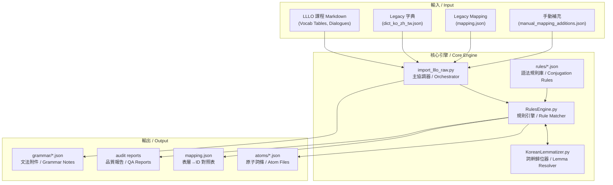
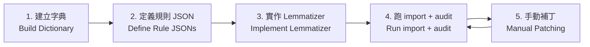

# V5 自動化架構：從原始內容到原子化 Atom
# V5 Automation Architecture: From Raw Content to Atomized Atoms

> **對象 / Audience**: 專案擁有者，用於理解系統全貌 / Project owner, for understanding the full system.
>
> **最後更新 / Last Updated**: 2026-02-15

---

## 0. 一句話總結 / One-Liner Summary

> 只要有**完整字典**＋**規則引擎**＋**編碼標準化**，丟進任何新內容都能自動產生 Atom（詞條）與 Mapping（對照表）。
>
> With a **complete dictionary** + **rules engine** + **encoding normalization**, any new content can automatically generate Atoms (lexical entries) and Mappings (surface-to-ID lookup).

---

## 1. 系統架構總覽 / System Architecture Overview



---

## 2. Pipeline 四大步驟 / The 4-Step Pipeline

### Step 1：內容攝取 / Content Ingestion
**檔案 / File**: [import_lllo_raw.py](file:///Users/ywchen/Dev/lingo/content-ko/scripts/import_lllo_raw.py)

| 做什麼 / What it does | 怎麼做 / How |
|---|---|
| 讀取 LLLO 原始 Markdown 課程檔 | 解析 `.md` 中的 Markdown Table（詞彙表）和 `##` Section（文法） |
| 載入既有字典與對照表 | 從 `dict_ko_zh_tw.json`、`mapping.json`、`manual_mapping_additions.json` 三個來源合併 |
| 發現新詞彙 (Atom Discovery) | 詞彙表中的韓文詞自動嘗試建立 Atom |
| 掃描對話句找用例 | 從 `dialogue/*.json` 中提取韓文 Token，嘗試拆解並對應到 Atom |

**關鍵邏輯 / Key Logic**:
```python
# 詞彙表中的詞強制加入 (force_add=True)
# Words in vocabulary tables are forcefully added
add_atom(row[0], row[1], f"lllo:A1:{lesson_id}", force_add=True)

# 對話中的詞只有在字典裡找到時才加入 (discovery only)
# Words from dialogues are only added if found in dictionary
if lemma in legacy_id_map:
    add_atom(lemma, "", f"dialogue:{lesson_id}")
```

> [!IMPORTANT]
> **「字典擁有否決權」**：對話中出現的詞如果不在字典裡，系統不會自動建立 Atom，而是放進 `missing_mapping_candidates.json` 等待人工審核。這確保不會產生垃圾 Atom。
>
> **"Dictionary has veto power"**: Words from dialogues that aren't in the dictionary won't auto-create Atoms. They go to `missing_mapping_candidates.json` for manual review.

---

### Step 2：規則分解 / Rule-Based Decomposition
**檔案 / File**: [rules_engine.py](file:///Users/ywchen/Dev/lingo/content-ko/scripts/core/rules_engine.py)

這是系統的「大腦」。它把一個表層詞（如 `학생입니다`）拆成有意義的語素。

This is the "brain" of the system. It decomposes a surface token (e.g., `학생입니다`) into meaningful morphemes.

#### 2a. 規則結構 / Rule Structure
規則存放在 `scripts/core/rules/*.json`，按檔名排序載入：

Rules are stored in `scripts/core/rules/*.json`, loaded in filename order:

| 檔案 / File | 用途 / Purpose | 優先級 / Priority |
|---|---|---|
| `00_dictionary.json` | 字典直查 / Direct dictionary lookup | 最高 / Highest |
| `10_particles.json` | 助詞剝離 / Particle stripping (`은/는/이/가`) | 高 / High |
| `20_copula.json` | 繫詞 / Copula (`입니다/이에요/예요`) | 中 / Medium |
| `30_verb_endings.json` | 動詞語尾 / Verb conjugations (`아요/어요/았어요`) | 中 / Medium |
| `40_honorifics.json` | 敬語 / Honorifics (`세요/시`) | 低 / Lower |

每條規則包含：
Each rule contains:

```json
{
  "id": "verb_past_polite",
  "input_pattern": "^(.+)(았어요|었어요)$",    // 正則比對 / Regex pattern
  "atoms_template": ["ko:v:{stem}"],            // Atom 模板 / Atom template
  "reconstruct_template": "{stem}{suffix_arg}",  // 還原模板 / Reconstruction template
  "priority": 50,
  "dictionary_required": false
}
```

#### 2b. 匹配流程 / Matching Flow
```
Token: "갔어요" (went, polite past)
  ↓
Rule: verb_past_polite_ss_contracted
  Pattern: ㅆ + 어요 (SS contraction detected)
  ↓
Stem extraction: "가" (go)
  ↓
Lemmatizer resolves: "가" → "가다" (to go)
  ↓
Dictionary check: "가다" ✅ found in mapping.json
  ↓
Output:
  - Atom: "ko:v:가다"
  - Reconstruction: "갔어요" ✅ matches original
  - Confidence: 0.95
```

#### 2c. 特殊處理：韓語編碼 / Special Handling: Korean Encoding

> [!WARNING]
> **這是目前韓語最大的技術債 / This is the biggest tech debt for Korean.**

韓語字母在 Unicode 中有兩種表示法：

Korean characters have two Unicode representations:

| 類型 / Type | 範例 / Example | 用途 / Use |
|---|---|---|
| **NFC** (Composed) | `갔` = 1 code point | 正常顯示 / Normal display |
| **NFD** (Decomposed) | `갔` = `ㄱ` + `ㅏ` + `ㅆ` = 3 code points | 字母拆解分析 / Jamo analysis |

系統在處理收尾子音（Batchim）時需要在 NFC/NFD 之間切換：

The system switches between NFC/NFD when handling final consonants (Batchim):

```python
# 1. 拆開看最後一個字母 / Decompose to inspect last Jamo
decomposed = unicodedata.normalize("NFD", token)  # "갔" → ㄱ+ㅏ+ㅆ
last_jamo = decomposed[-1]                         # ㅆ

# 2. 去掉最後字母，重新組合 / Remove last Jamo, recompose
stem = unicodedata.normalize("NFC", decomposed[:-1])  # ㄱ+ㅏ → "가"

# 3. 最終輸出一定要 NFC / Final output must be NFC
reconstruction = unicodedata.normalize("NFC", f"{stem}{suffix_arg}")
```

> [!CAUTION]
> **目前的瓶頸**：`ㅂ` 不規則動詞（如 `덥다` → `더워요`）在還原時產生的字元序列與字典中的 NFC 不一致，導致匹配失敗。這是 `HANDOVER_NOTES.md` 中記錄的 ~70 個未解析 Token 的根本原因。
>
> **Current bottleneck**: ㅂ-irregular verbs (e.g., `덥다` → `더워요`) produce character sequences during reconstruction that don't bitwise-match the NFC entries in the dictionary.

---

### Step 3：詞幹歸位 / Lemma Resolution
**檔案 / File**: [lemmatizer.py](file:///Users/ywchen/Dev/lingo/content-ko/scripts/core/lemmatizer.py)

`RulesEngine` 找到的是**詞幹（Stem）**，`Lemmatizer` 負責把它**還原為辭典形（Infinitive / Dictionary Form）**。

The `RulesEngine` finds the **stem**; the `Lemmatizer` restores it to the **dictionary form (infinitive)**.

#### 處理邏輯 / Resolution Logic

| 步驟 / Step | 範例 / Example | 說明 / Explanation |
|---|---|---|
| 1. 縮約查表 / Contraction lookup | `제` → `저` | 直接對應 / Direct mapping |
| 2. 已知不規則 / Known irregulars | `더워` → `덥다` | 硬編碼的對照表 / Hardcoded mapping |
| 3. 過去式剝離 / Past tense stripping | `했` → `하다` | 去掉 `았/었/였` 後加 `다` |
| 4. 中間標記 / Intermediate markers | `가는데` → `가` + `는데` | 剝離 `거든/는데/군` 等 |
| 5. 禮貌母音 / Politeness vowel | `맞아` → `맞` | 去掉尾部 `어/아` |
| 6. 預設兜底 / Default fallback | `먹` → `먹다` | 直接加 `다` |

**所有路徑最終都指向同一個 Atom ID**：
**All paths converge to the same Atom ID**:

```
합니다 → 하+ㅂ니다 → 하다 → ko:v:하다
했어요 → 했+어요 → 하+ㅆ+어요 → 하다 → ko:v:하다
해요   → 해+요 → 하+여+요 → 하다 → ko:v:하다
하고   → 하+고 → 하다 → ko:v:하다
```

---

### Step 4：驗證與產出 / Validation & Output

#### 4a. 信心度評分 / Confidence Scoring

| 分數 / Score | 意義 / Meaning | 處理方式 / Action |
|---|---|---|
| **1.0** | 規則匹配 + 字典命中 + 還原成功 | ✅ 自動採用 / Auto-accept |
| **0.9** | 規則匹配 + 字典命中，但有些微歧義 | ✅ 自動採用（標記） |
| **0.4** | 規則匹配成功，但字典**未命中** | ⚠️ 標記為 `LOW_CONF`，需人工確認 |
| **0.0** | 還原失敗（重建結果 ≠ 原始 Token） | ❌ 跳過此規則，嘗試下一條 |

#### 4b. 輸出檔案 / Output Files

**Atom 核心檔 / Core Atom File** (`atoms/{POS}/{atom_id}.json`):
```json
{
  "atom_id": "ko:v:하다",
  "fs_safe_id": "ko__v__하다",          // Windows 安全路徑
  "lemma_id": "하다",
  "surface_forms": ["하다", "해요", "합니다", "했어요"],
  "pos": "V",
  "senses": [{"definition_ref": "base", "labels": []}]
}
```

**Atom 翻譯檔 / I18n Atom File** (`i18n/zh_tw/dictionary/{atom_id}.json`):
```json
{
  "atom_id": "ko:v:하다",
  "headword": "하다",
  "pos": "V",
  "definitions": {
    "zh_tw": ["做、進行"]
  }
}
```

**Mapping 對照表 / Mapping Table** (`mapping.json`):
```json
{
  "하다": "ko:v:하다",
  "해요": "ko:v:하다",
  "합니다": "ko:v:하다",
  "했어요": "ko:v:하다"
}
```

---

## 3. 可逆分解：為什麼這很重要？
## 3. Reversible Decomposition: Why Does This Matter?

V5 標準的核心要求是 **100% 可逆**：從 Atom 序列可以完美重建原始句子。

The core requirement of the V5 standard is **100% reversibility**: the original sentence can be perfectly reconstructed from an Atom sequence.

### 實際範例 / Practical Example

**原句 / Original**: `저는 학생입니다` (我是學生 / I am a student)

**分解結果 / Decomposition Result**:

| # | Surface | Type | Atom ID | Grammar Ref |
|---|---|---|---|---|
| 1 | `저` | word | `ko:pron:저` | |
| 2 | `는` | particle | — | `ko:g:topic-marker` |
| 3 | ` ` | whitespace | — | |
| 4 | `학생` | word | `ko:n:학생` | |
| 5 | `입니다` | copula | — | `ko:g:copula-formal` |

**還原公式 / Reconstruction Formula**:
```
Original = Join(segment.surface for segment in segments)
        = "저" + "는" + " " + "학생" + "입니다"
        = "저는 학생입니다" ✅
```

> [!TIP]
> **這就是為什麼 Atom 和 Grammar 分開存放的理由**：修改 `학생` 的翻譯不需要動到任何句子檔案；修改 `입니다` 的文法解釋不需要動到任何詞條。
>
> **This is why Atoms and Grammar are stored separately**: changing the translation of `학생` doesn't touch any sentence file; changing the grammar note for `입니다` doesn't touch any lexical entry.

---

## 4. 品質控管機制 / Quality Control Mechanism

### 4a. 自動審計 / Automated Audit (`audit_03b.py`)

| 檢查項目 / Check | 判定條件 / Condition | 嚴重度 / Severity |
|---|---|---|
| 信心度不足 / Low confidence | `0 < confidence < 0.9` | ⚠️ Warning |
| 語意錯誤 / Semantic mismatch | Token 含 `없` 但 Atom 含 `있다` | 🔴 Bug |
| 編碼不一致 / Encoding mismatch | NFC output ≠ NFC dictionary entry | 🔴 Bug |

### 4b. Gate 機制 / Gate System

```
Gate 1: missing_mapping_candidates.json
         → 未知詞列表 / Unknown word list
         → 必須在 manual_mapping_additions.json 中補齊才能繼續
         → Must resolve before proceeding

Gate 2: audit_03b_results.txt
         → 低信心度與語意異常列表 / Low-confidence & semantic anomaly list
         → 可容忍少量，但必須趨近 0
         → Tolerable in small numbers, but must trend toward 0
```

---

## 5. 各語系自動化難度一覽 / Language Automation Difficulty

| 語系 / Lang | 難度 / Difficulty | 主要挑戰 / Main Challenge | 自動化潛力 / Automation Potential |
|---|---|---|---|
| **🇰🇷 韓語 KO** | ★★★★★ | 黏著語 + Jamo 編碼 + 大量不規則 | 目前 ~93% 自動，目標 100% |
| **🇯🇵 日語 JA** | ★★★★☆ | 五段活用 + 漢字讀音 + 音便 | 五段矩陣可批量生成，讀音需額外處理 |
| **🇹🇭 泰語 TH** | ★★★☆☆ | 無空格斷詞 | 斷詞後 Mapping 穩定 |
| **🇩🇪 德語 DE** | ★★★☆☆ | 格位變化 + 動詞變位 | 有空格，分詞容易 |
| **🇨🇳 中文 ZH** | ★★☆☆☆ | 斷詞（無空格） | 無語法變形，斷詞後接近 100% |
| **🇺🇸 英語 EN** | ★☆☆☆☆ | 幾乎無挑戰 | 有空格 + 極少變形 |

---

## 6. 如何為新語言建立 Pipeline？
## 6. How to Build a Pipeline for a New Language?



| 步驟 / Step | 說明 / Description |
|---|---|
| 1. 建立字典 | 提供**表層形 → Lemma → POS → 翻譯**的 JSON。這是基石。 |
| 2. 定義規則 | 為該語言撰寫 `rules/*.json`，描述語法變形的正則表達式。 |
| 3. 實作 Lemmatizer | 替換 `KoreanLemmatizer` 為該語言版本（如 `JapaneseLemmatizer`）。 |
| 4. 執行 + 審計 | 跑 `import_lllo_raw.py`，再跑 `audit_03b.py` 檢查結果。 |
| 5. 手動補丁 | 針對 `UNRESOLVED` 的 Token 補充到 `manual_mapping_additions.json`。反覆迭代直到收斂。 |

---

## 7. 目前狀態與下一步 / Current Status & Next Steps

### 韓語 (content-ko)
- **已完成 / Done**: Pipeline 完整建立，93%+ Token 已自動解析
- **剩餘 / Remaining**: ~70 個 Token 因 Jamo 編碼問題未解析
- **下一步 / Next**: 修復 `30_verb_endings.json` 中 `ㅂ` 不規則動詞的還原邏輯

### 基礎建設 / Infrastructure
- **已完成 / Done**: Windows 路徑相容 (`:`→`__`)、V5 Schema 對齊 (`core-schema`)
- **下一步 / Next**: 將 `mapping.json` 匯出為標準 CSV 以支援語言學家編輯
