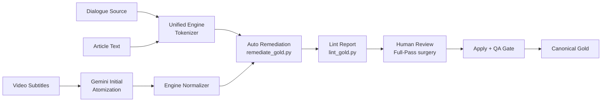

# Unified Content Atomization Pipeline Proposal

**Date**: 2026-04-13
**Status**: Proposal / Draft
**Goal**: Harmonize segmentation granularity across all content types (Dialogue, Video, Article) using the V5 Engine as the canonical validator.

## 1. Problem Statement

Segmentation granularity currently differs between Dialogue GSD and Video Atoms, even when theoretically following the same SOP (`KO_DATA_STANDARDIZATION_PROTOCOL.md`). 

### Comparative Analysis

| Feature | Dialogue (Gold Standard) | Video Atoms |
|:---|:---|:---|
| **Generation** | Engine Tokenizer + Rules | Gemini Prompt-based |
| **Control** | Hardcoded logic + Surgery Heuristics | Natural language description |
| **Past Tense (`었/았`)** | Forced Split (`았` + `어요`) | Often Fused (`았어요`) |
| **Space / Punct** | Excluded from Language Gold | Included as Atoms (for reversibility) |
| **Post-processing** | `remediate_gold.py` + `lint_gold.py` | `verify_video_atoms.py` (Reversibility only) |

## 2. Design Principles: The Engine is Law

The core principle of this proposal is that **granularity is determined by the Engine, not the generation tool.**

1.  **Recursive Decomposition**: All composite endings must be broken down into their smallest atomic units (e.g., `았어요` → `ko:e:았` + `ko:e:어요`).
2.  **Phrase Stratification**: 
    *   **Gold Level**: Decomposed into morphemes for precise analysis.
    *   **Dictionary Level**: Exist as high-level `ko:phrase` entries for UI mapping.
3.  **Atom Integrity**: Video Atoms MUST maintain explicit `ko:space` and `ko:punct` atoms to ensure 100% reversibility for subtitle timing.

## 3. Proposed Unified Workflow

We will move from a tool-specific workflow to a **Unified Content Atomization Pipeline**.

### Key Components

#### A. Engine Normalizer (`normalize_video_atoms.py`)
A new script that re-processes Gemini-generated atoms through the `KoreanTokenizer`.
*   If Engine confidence ≥ 0.9: Overwrite Gemini atoms with Engine atoms (ensures strict SOP).
*   If Engine confidence < 0.9: Preserve Gemini/Manual atoms but flag for review.

#### B. Format Adapters
Update `lint_gold.py` and `remediate_gold.py` to support the Video Atoms JSON structure (treating each `turn` as a row similar to Dialogue JSONL).

#### C. Unified QA Gate (`qa_gate.py`)
Extend the current Dialogue QA gate to verify Video content for:
1.  **Reversibility**: (Match existing `verify_video_atoms.py`).
2.  **Granularity**: Detect un-decomposed composite endings.
3.  **Taxonomy**: Enforce `pos_taxonomy.py` compliance.

## 4. Implementation Roadmap

### Phase 1: Tooling Upgrade
*   [ ] Refactor `lint_gold.py` to accept `--content-type=video`.
*   [ ] Create `normalize_video_atoms.py`.
*   [ ] Update Video prompt in `build_gemini_video_atom_bundle.py` with explicit V5 rules.

### Phase 2: Pilot Alignment
*   [ ] Run Normalizer on `BWINkN8QbkU_atoms.json`.
*   [ ] Perform `lint` + `remediate` to align with Dialogue A1 granularity.

### Phase 3: Stabilization
*   [ ] Enforce full-pass attestation for Video reviews.

## 5. Open Questions for Review

1.  **Attestation Rigor**: Should Video reviews require the same `surgery_full_pass_attest.json` as high-stakes Dialogue GSD?
2.  **JSONL Parallel**: Should we generate a standard JSONL "Language Only" view for every video to allow 1:1 comparison with Dialogue A1?
3.  **Legacy Catch-up**: Should all existing "Silver" video atoms be retroactively normalized before being promoted to "Gold"?

---
*Created by Antigravity (AI Assistant) for the Lingourmet Project.*
