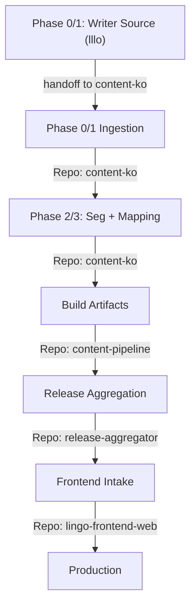
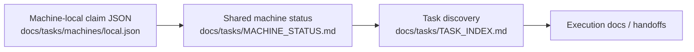

# Workflow Map

Standard operational flow for the Lingo Content Ecosystem.

Current human-readable source of truth:
- `docs/human-handbook/00_START_HERE.md`
- `release-aggregator/docs/tasks/MACHINE_STATUS.md`

## Phase Details

### 1. Writer Source (`lllo`) -> Ingestion (`content-ko`)
- **Boundary**: `lllo` is not a release repo. It only provides writer/source inputs.
- **Handoff**: ingestion scripts import and normalize into `content-ko` canonical source.

### 2. Seg + Mapping (content-ko)
- **Tool**: `scripts/import_lllo_raw.py`
- **Output**: canonical source in `content/source/ko/*` with core/i18n split.
- **Doc**: [lllo_ingestion_bootstrap.md](runbooks/lllo_ingestion_bootstrap.md)

### 3. Build (content-pipeline)
- **Goal**: build and validate artifacts from canonical source.
- **Reusable Python Entrypoints**
  - `main.py` in `content-pipeline`: unified verify/build/integrity workflow.
  - `pipelines/build.py`: production lesson artifact build.
  - `pipelines/learning_library.py`: learning-library artifact export for frontend intake.
  - `scripts/mapping_tool.py`: mapping verification helper.
  - `scripts/integrity_gate.py`: build-output integrity gate.
  - `scripts/handoff/export_frontend_intake.py`: frontend package and manifest export.
  - `scripts/sync_video_to_frontend.py`: sync video/dialogue output and update manifests.

### 4. Release (release-aggregator)
- **Tool**: `scripts/release.py` and `scripts/release.sh`
- **Validation**: strict schema check against `core-schema`.
- **Reusable Python Entrypoints**
  - `scripts/prg/seed_release_manifest.py`: derive release manifest seed data from pipeline outputs.
  - `scripts/prg/assembler_prototype.py`: manifest-driven packaging and catalog derivation.
  - `scripts/release.py`: release assembly and schema validation.

### 5. Intake (lingo-frontend-web)
- **Action**: sync assets to app and verify runtime contracts.
- **Doc**: [release_cut_and_rollback.md](runbooks/release_cut_and_rollback.md)

## Session Closeout Routing
When user says "收工", choose closeout protocol by touched repositories:
- Dispatcher: [gemini_closeout_protocol.md](runbooks/gemini_closeout_protocol.md)
- Frontend: [closeout_frontend.md](runbooks/closeout_frontend.md)
- Content: [closeout_content.md](runbooks/closeout_content.md)
- Pipeline: [closeout_pipeline.md](runbooks/closeout_pipeline.md)
- Release: [closeout_release.md](runbooks/closeout_release.md)
- Core Schema: [closeout_schema.md](runbooks/closeout_schema.md)

## Machine Claim Flow

At session start:
1. Read the shared machine status summary.
2. Read or create the local machine claim JSON.
3. Update the shared status before taking a new task.
4. Treat the shared status as the source of truth for current ownership.

## Execution Modes
- `classic_stage`: single repo + single stage, follow [gemini_stage_execution_protocol.md](runbooks/gemini_stage_execution_protocol.md).
- `gsd_phase`: multi-repo orchestration or phase waves, follow [gsd_multi_repo_workflow.md](runbooks/gsd_multi_repo_workflow.md).

For repository ownership boundaries, see [owners.md](owners.md).
