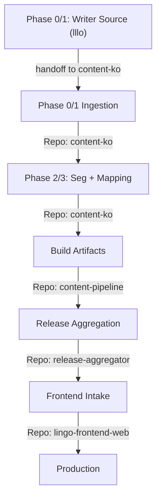

# Workflow Map

Standard operational flow for the Lingo Content Ecosystem.

## Phase Details

### 1. Writer Source (`lllo`) -> Ingestion (`content-ko`)
- **Boundary**: `lllo` is not a release repo. It only provides writer/source inputs.
- **Handoff**: ingestion scripts import and normalize into `content-ko` canonical source.

### 2. Seg + Mapping (content-ko)
- **Tool**: `scripts/import_lllo_raw.py`
- **Output**: canonical source in `content/source/ko/*` with core/i18n split.
- **Doc**: [lllo_ingestion_bootstrap.md](runbooks/lllo_ingestion_bootstrap.md)

### 3. Build (content-pipeline)
- **Goal**: build and validate artifacts from canonical source.

### 4. Release (release-aggregator)
- **Tool**: `scripts/release.py` and `scripts/release.sh`
- **Validation**: strict schema check against `core-schema`.

### 5. Intake (lingo-frontend-web)
- **Action**: sync assets to app and verify runtime contracts.
- **Doc**: [release_cut_and_rollback.md](runbooks/release_cut_and_rollback.md)

## Session Closeout Routing
When user says "收工", choose closeout protocol by touched repositories:
- Dispatcher: [gemini_closeout_protocol.md](runbooks/gemini_closeout_protocol.md)
- Frontend: [closeout_frontend.md](runbooks/closeout_frontend.md)
- Content: [closeout_content.md](runbooks/closeout_content.md)
- Pipeline: [closeout_pipeline.md](runbooks/closeout_pipeline.md)
- Release: [closeout_release.md](runbooks/closeout_release.md)
- Core Schema: [closeout_schema.md](runbooks/closeout_schema.md)

For repository ownership boundaries, see [owners.md](owners.md).
