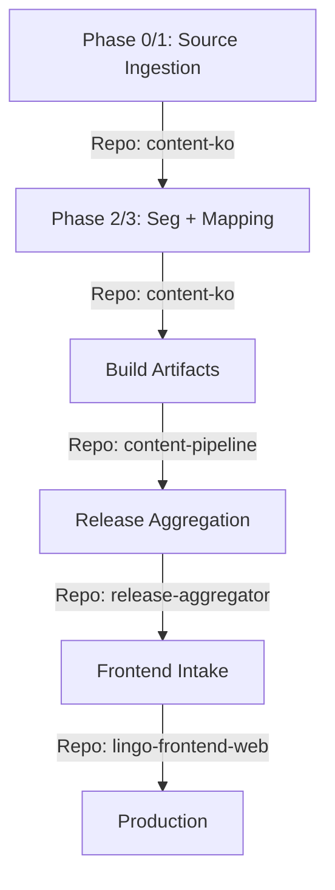

# Workflow Map

Standard operational flow for the Lingo Content Ecosystem.

## Phase Details

### 1. Source Ingestion (content-ko)
- **Tool**: `scripts/import_lllo_raw.py`
- **Output**: Categorized atoms in `content/source/ko/core/dictionary/atoms/`
- **Doc**: [lllo_ingestion_bootstrap.md](runbooks/lllo_ingestion_bootstrap.md)

### 2. Seg + Mapping (content-ko)
- **Tool**: `scripts/generate_mapping_patch.py`
- **Goal**: Align surface forms to stable Atom IDs.

### 3. Build (content-pipeline)
- **Tool**: `pipelines/build_ko_zh_tw.py`
- **Validation**: Strict schema check against `core-schema`.

### 4. Release (release-aggregator)
- **Tool**: `scripts/release.sh`
- **Doc**: [release_cut_and_rollback.md](runbooks/release_cut_and_rollback.md)

### 5. Intake (lingo-frontend-web)
- **Action**: Sync assets to app and verify runtime contracts.
