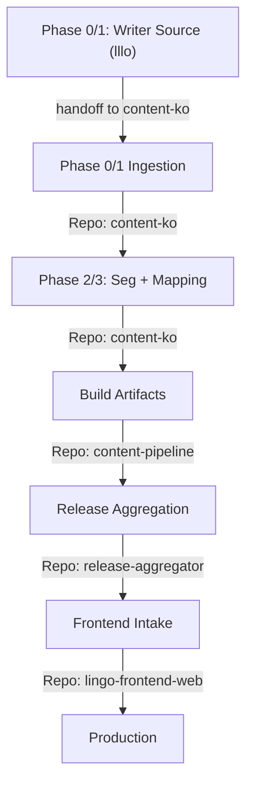

# Workflow Map

Standard operational flow for the Lingo Content Ecosystem.

## Phase Details

### 1. Writer Source (`lllo`) -> Ingestion (`content-ko`)
- **Boundary**: `lllo` is not a release repo. It only provides writer/source inputs.
- **Handoff**: ingestion scripts import and normalize into `content-ko` canonical source.

### 2. Seg + Mapping (content-ko)
- **Tool**: `scripts/import_lllo_raw.py`
- **Output**: canonical source in `content/source/ko/*` with core/i18n split.
- **Doc**: [lllo_ingestion_bootstrap.md](runbooks/lllo_ingestion_bootstrap.md)

### 3. Build (content-pipeline)
- **Tool**: `scripts/generate_mapping_patch.py`
- **Goal**: build and validate artifacts from canonical source.

### 4. Release (release-aggregator)
- **Tool**: `scripts/release.py` and `scripts/release.sh`
- **Validation**: Strict schema check against `core-schema`.

### 5. Intake (lingo-frontend-web)
- **Action**: Sync assets to app and verify runtime contracts.
- **Doc**: [release_cut_and_rollback.md](runbooks/release_cut_and_rollback.md)

For repository ownership boundaries, see [owners.md](owners.md).
